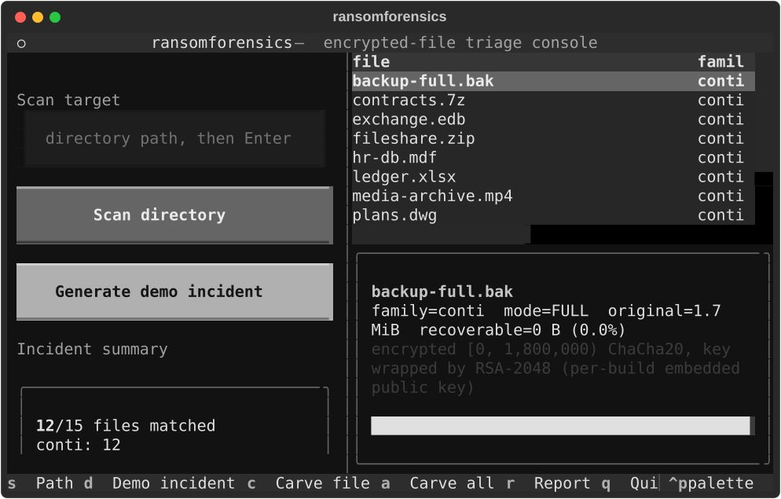

# ransomforensics

**Ransomware incident triage console: identify the family, map what was encrypted, and recover everything that wasn't — no malware binary, no keys, no live samples required.**

Most ransomware does *not* encrypt entire files. To hit terabytes quickly, encryptors touch only a fraction of each victim file — 25–50% of large files, or just the first 1 MiB — leaving the rest untouched on disk. The trailing metadata the encryptor appends (its "footer") tells you exactly which byte ranges were never touched. ransomforensics parses those footers across a whole directory tree, aggregates an incident summary, and carves out the recoverable plaintext — keyless recovery of whatever the operator skipped.

Ship it as a TUI console, a headless CLI, or a Python library.



## The 30-second demo

```bash
pip install -e ".[tui]"
ransomforensics-tui
```

Press **D**. The app generates a synthetic ransomware incident (a dozen fake "encrypted" VM disks, databases and archives plus decoy noise files — all synthetic, zero real malware), then triages it: family identification per file, encrypted vs. untouched region maps, live recovery totals, one-key carve, and a markdown incident report.

## What it answers

When a ransomware incident lands, the first questions are:

1. *Which family is this?* — structural footer matching per file, no sample execution.
2. *Is anything recoverable without paying?* — a 5 GB PARTLY(50%) VM disk yields 2.5 GB of untouched plaintext back with zero keys.
3. *What exactly did the encryptor do to each file?* — mode, cipher, key-wrap scheme, original size, per-file region layout.

## CLI

```bash
# interactive triage console (textual TUI)
ransomforensics-tui

# headless triage of a whole tree, with report + carve
ransomforensics scan /mnt/victim_disk --report incident.md --carve recovered/

# single-file inspection
ransomforensics analyze victim.vhdx

# carve one file's untouched regions
ransomforensics carve victim.vhdx --out recovered/

# generate a synthetic fixture (for testing your own tooling)
ransomforensics gen --size 10000000 --mode partly --percent 25 --out sample.bin
```

Headless `scan` output:

```
scanned 15 files under demo_incident
  matched   : 12
  unmatched : 3
  conti     : 12 files, 9.7 MiB recoverable
TOTAL keyless-recoverable: 9.7 MiB of 17.7 MiB (54.8%)
report written to incident.md
```

## How it works

Take Conti (family parser shipped here, documented from the leaked locker source):

```
[ ciphertext overwriting part of the original file ]
[ 524-byte RSA-wrapped key blob: ChaCha20 key(32B)+IV(8B) ]   <- footer
[ 10-byte trailer: mode(1) | data_percent(1) | orig_size(8 LE) ]
```

The parser reads the footer (a 64 KiB tail read for huge files — no full VHDX scans), validates the trailer (`mode ∈ {0x24 FULL, 0x25 PARTLY, 0x26 HEADER}`, declared size matches file length), and derives the region map:

| Mode | Encrypted region | Untouched tail |
|---|---|---|
| FULL (0x24) | entire file | none |
| PARTLY (0x25) | first `percent`% | the rest |
| HEADER (0x26) | first 1 MiB | everything past 1 MiB |

Everything below the red block in the TUI's region bar is carvable verbatim — it was never encrypted.

## Library use

```python
from pathlib import Path
from ransomforensics import analyze_file, carve, scan_directory, write_report

# single file
analysis = analyze_file("victim.vhdx")
print(analysis.family, analysis.recoverable_ratio)     # e.g. "conti 0.76"

# whole incident
result = scan_directory("/mnt/victim_disk")
print(result.stats.total_recoverable_bytes)
write_report(result, "incident.md")
```

## Adding a family

Parsers are pure-structure readers — implement `FamilyParser` and register it:

```python
# src/ransomforensics/parsers/yourfamily.py
class YourFamilyParser(FamilyParser):
    FAMILY = "yourfamily"
    def parse(self, data: bytes, path, file_size=None) -> Analysis | None:
        ...  # validate footer, build region map, return Analysis (or None)
```

Then append it to `registered_parsers()` in `detector.py`. Families worth adding next (footer layouts are publicly documented in incident-response writeups): Black Basta, LockBit 3.0, Akira, Royal/BlackSuit.

## Safety model

- **No malware in this repo.** All test fixtures are synthetic: generated from the format spec by `generator/`, containing random bytes and marker patterns — no real ciphertext, no real keys. The TUI's demo incident is generated the same way at runtime.
- **No execution.** The tool only reads files and writes recovered regions and reports.
- **Defensive purpose.** Built for incident responders and DFIR work; the same region mapping that guides recovery also documents the encryptor's behavior for the incident report.

## Development

```bash
pip install -e ".[tui,dev]"
pytest          # 27 tests: parsers, scanner, report, and the TUI itself
```

The TUI is tested with [Textual's Pilot harness](https://textual.textualize.io/guide/testing/) — the demo incident, carve, and report flows are exercised end-to-end, headless.

## License

MIT
